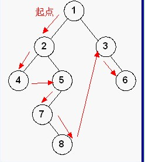
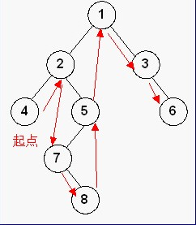
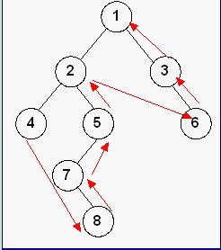

## 1. 二叉树基本概念

二叉树是树的特殊一种，具有如下特点：1、每个结点最多有两颗子树，结点的度最大为2。2、左子树和右子树是有顺序的，次序不能颠倒。3、即使某结点只有一个子树，也要区分左右子树。

<!-- more -->

## 2. 二叉树性质

## 3. 二叉树遍历

遍历是对树的一种最基本的运算，所谓遍历二叉树，就是按一定的规则和顺序走遍二叉树的所有结点，使每一个结点都被访问一次，而且只被访问一次。由于二叉树是非线性结构，因此，树的遍历实质上是将二叉树的各个结点转换成为一个线性序列来表示。

设L、D、R分别表示遍历左子树、访问根结点和遍历右子树， 则对一棵二叉树的遍历有三种情况：DLR（称为先根次序遍历），LDR（称为中根次序遍历），LRD （称为后根次序遍历）。

### 3.1 先序遍历（DLR）

基本思想：先访问根结点，再先序遍历左子树，最后再先序遍历右子树即根—左—右。



前序遍历(preorder traversal) Python实现：

```bash
class TreeNode:
    def __init__(self, x):
        self.val = x
        self.left = None
        self.right = None
	# 前序遍历
    def preTraversal(self, root):
        """
        :type root: ListNode
        """
        
        if root == None:
            return
        print(root.val)
        self.preTraverse(root.left)
        self.preTraverse(root.right)
```


### 3.2 中序遍历（LDR）

基本思想：先中序遍历左子树，然后再访问根结点，最后再中序遍历右子树即左—根—右。



中序遍历(inorder traversal) Python实现：

```bash
class TreeNode:
    def __init__(self, x):
        self.val = x
        self.left = None
        self.right = None
	# 中序遍历
    def inTraversal(self, root):
        """
        :type root: ListNode
        """
        
        if root == None:
            return   
        self.preTraverse(root.left)
        print(root.val)
        self.preTraverse(root.right)
```


### 3.3 后序遍历（LRD）

基本思想：先后序遍历左子树，然后再后序遍历右子树，最后再访问根结点即左—右—根。



后序遍历(postorder traversal) Python实现：

```bash
class TreeNode:
    def __init__(self, x):
        self.val = x
        self.left = None
        self.right = None
	# 后序遍历
    def postTraversal(self, root):
        """
        :type root: ListNode
        """
        
        if root == None:
            return   
        self.preTraverse(root.left)
        self.preTraverse(root.right)
        print(root.val)
```


